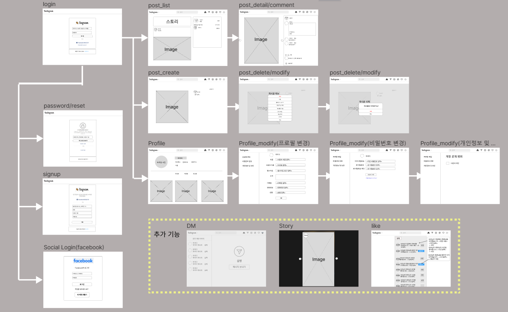

### 내일배움캠프 2번째 프로젝트
# Insta_Clone

https://bolder-starburst-a73.notion.site/06b32514c6434ec1845ef249066a22df

## ****프로젝트 핵심 목적****

- Meta의 인스타그램 클론코딩을 통한 사용자 환경(UI/UX)을 구성한다.
- 사용자들이 편리하게 개인의 포스팅을 올리고, 서로의 페이지를 공유하여 댓글, Follow, 좋아요 등을 통해 커뮤니티를 형성할 수 있는 공간을 제공한다.

## ****🎈 기능 명세서****

- HTML/CSS/Javascript를 활용한 프론트엔드 페이지 구성
- 사용자 환경(회원가입, 로그인(소셜로그인), 회원정보 관리, 비밀번호 변경 등)
- 게시글 작성, 수정, 삭제 기능 구현(사진 업로드, Carousel기능 등등)
- 팔로우를 통해 피드에서 게시글 확인, 댓글 작성 등

# ⚙ 개발환경

## back-end :  

## front-end :    

### API

- Kakao API

## ****🕸 와이어 프레임****

## ****🎯 데이터베이스****

## ****🎨 API 설계****

